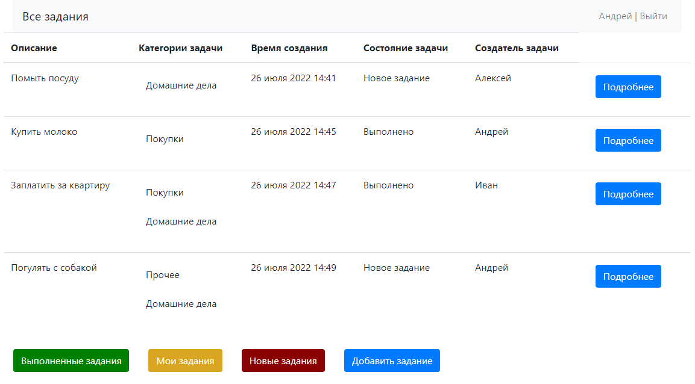
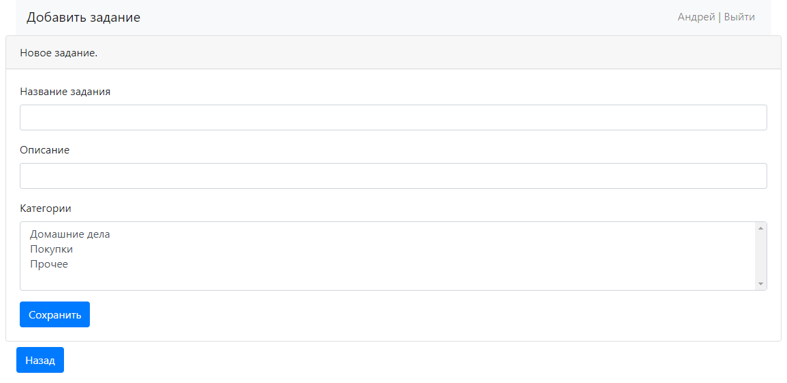

<a name="title"><h2>Приложение TODO List</h2></a>

Приложение-список задач. Можно просматривать, редактировать, добавлять и удалять задания.

<a name="tech"><h2>Стек используемых технологий</h2></a>

Страница со всеми заданиями:

У каждого задания в списке можно прочесть его конкретное описание, нажав кнопку "Подробнее".
Переходы ниже таблицы заданий ведут на страницы с выполненными либо невыполненными заданиями, 
также можно добавить новое задание.

Страница с завершенными заданиями:

Страница с новыми заданиями:

Страница добавления нового задания:

При добавлении новому заданию автоматически присваиваются текущие дата/время.

Страница с подробным описанием отдельного завершенного задания:

Страница с подробным описанием отдельного незавершенного задания:

При нажатии на кнопку "Выполнено" задание переходит в статус завершенного.

Страница редактирования задания:

Можно изменять краткое описание задания, отображающееся на странице всех заданий, 
а также полное описание, отображающееся при переходе на конкретное задание.
Также можно изменять статус задания.
При редактировании заданию автоматически присваиваются текущие дата/время.